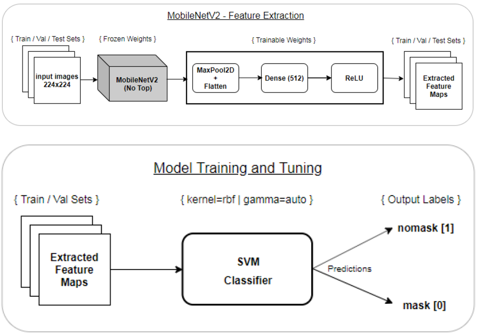

# Face Mask Detection

> ### Face mask detection using deep learning techniques.
---

## Table of Contents

- [Introduction](#introduction) 
- [Objective](#objective)
- [Dataset](#dataset)
- [Solution Approach](#solution-approach)
- [Evaluation Metrics](#evaluation-metrics)
- [Conclusion](#Conclusion)
- [Further Improvements](#furthe-improvements)
- [How To Use](#how-to-use)
- [License](#license)
- [Author Info](#author-info)

---

## Introduction
Face masks have proven to be very effective against COVID-19 spread. Even though facemasks are proving to be very effective prevention measure there are obvious resistance from society in general. However, given the seriousness of COVID-19 spread, in many countries, authorities have started monitor and enforce the usage of facemasks in public places. But it’s almost impossible do this manually. The rise of machine-learning/deep-learning techniques (ML/DL) in recent years presents a huge opportunity to fight the pandemic through cutting-edge technology. The aim of this project is to implement, test, compare multiple ML/DL models for automatic facemask detection. 

_This was my thesis for M.S. (Data Science) program. If you are interested, you can access the complete thesis report from [here](https://drive.google.com/file/d/12uLJ9UPAKGBc2Pv160RYt4SEJ5NS4_ES/view?usp=sharing) and thesis defense presentation from [here](https://docs.google.com/presentation/d/1vzMyfzwsXxFYMCvwD3VAkKmPKQ6Py9YF/edit?usp=sharing&ouid=117056812088365898221&rtpof=true&sd=true)_

---
## Objective
Project aims to design, implement and compare multitude machine learning models utilizing modern ML and DL techniques to discriminate between the images of human faces wearing or not wearing facemasks. Following are the main objectives:
- To process the input raw images to get them ready for the model building
  - Upscale (increase image size) and downscale (decrease image size) the raw input images to ensure that they are all of same size
  - Ensure that there is no imbalance between the number of images in each class (nomask & mask). Balance the dataset by generating additional input images
- Use image augmentation to generate additional set of images from the original set of input images to increase the volume and variety of the training data.
- To implement and train pure DL architectures from ground-up (i.e. no pre-trained network) to classify images of the people wearing or not wearing facemasks.
- To implement and train pure DL architectures by leveraging the transfer-learning to classify images of the people wearing or not wearing facemasks.
- To implement and train DL architectures from ground-up but coupled with a classic learning model (e.g. SVM) as the classifier (i.e. hybrid network) to classify images of the people wearing or not wearing facemasks.
- To test, compare and interpret the model performance results based on various performance metrics.

---
## Dataset
Publicly available [Real-World-Masked-Face-Dataset (RFMD)](https://github.com/X-zhangyang/Real-World-Masked-Face-Dataset) dataset and [Simulated-World-Masked-Face-Dataset (SFMD)](https://drive.google.com/uc?id=1q0ibaoFVEmXrjlk3-Oyx2oYR8HpVy6jc&export=downloadand) dataset were used for model training, validation and evaluation. 
- The RFMD dataset contains 90,468 images of real-world human faces not wearing any facemask and 5,017 images of faces wearing facemasks.   

  
- The SFMD dataset contains 690 faces stimulated to appear as wearing facemasks and 686 images of faces not wearing any facemask. Figure 8 shows the sample mask and nomask images from RFMD dataset. 
  

  
The raw and fully processed dataset (data.zip, 1.5GB zip file) can be downloaded from  [here](https://drive.google.com/file/d/1THtv0JKDMKhkGgo-W7c-EtZGZ4MdnDgs/view?usp=sharing)
The data.zip contains main parent folder 'data'. Inside the 'data' folder there are three sub-folders:
1. _raw_dataset_: This is original dataset taken from publicly available datasets RFMD and SFMD. Original images from RFMD and SFMD are combined to create raw_dataset. 
2. _flatten_raw_dataset_: This is the raw_dataset after flattening of individual sub-folders within the raw_dataset.
3. _processed_dataset_  : This is the processed dataset. This dataset is used for model training, validation and testing.

---
## Solution Approach

### Data Preprocessing
Before we start building the models the raw data needs to be preprocessed to get it ready for modeling. Below listed preprocessing were performed...
1. The images in the original raw datasets were stored in a multilevel directory structure. Datasets required to be preprocessed to flatten the directory structure and move both images with masks and images without masks in their respective directory.
2. The images in the original raw datasets were available in different sizes and resolutions.Images were resized to 224x224 size to make them of the same size. 224x224 size was chosen because most of the pre-trained CNN networks expect image inputs in this size.
3. After above two steps we end up with a dataset that has heavy class imbalance where the number of real images without masks overpowers the number of real images with masks. In order to balance the dataset...
    * All real images with mask (5,017 images) and all the simulated images with mask (690 images) were combined to form a complete masked image dataset of 5,707 images.
    * Out of 90,468 real images without mask 5,017 images were chosen randomly and combined with all the simulated images without mask (686 images) to formed a complete "nomask" dataset of 5,703 images.
4. Random variation in images were introduced via image augmentation (rotation, horizontal flip, image shear, zoom in, zoom out etc) An important point to note here is that the augmented images were not stored as part of training dataset but they were created on the fly during the model training and then discarded. If the model required to be trained again then another set of totally different augmented images would be generated used for training.

### Model building
Various models were built using transfer learning (ResNet50, MobileNetV2 etc) and from scratch. Under both of these categories, further sub-configuration of the model such as a _pure_ network (Model with a CNN as a base and a fully connected layer (FC) as a classifier layer) and _hybrid_ network (Model with CNN as a feature extractor and shallow learning model such as an SVM is used as a classifier) were implemented.
  
#### 1. Transfer learning - ResNet50 & SVM Classifier (Hybrid)

  
#### 2. Transfer learning - MobileNetV2 & SVM Classifier (Hybrid)

  
#### 3. Transfer learning - ResNet50 & FC Classifier (Pure)

  
#### 4. Transfer learning - MobileNetV2 & FC Classifier (Pure)

  
#### 5. Custom Built - CNN & FC Classifier

  
#### 6. Custom Built - CNN & SVM Classifier
This network uses same custom CNN architecture as above but instead of a fully-connected classifier it uses SVM as classifier.

---
## Evaluation Metrics
The below listed metrics were recorded for each of six models we build, during training and evaluation phases...
* Number of Model Parameters
* Model Size (Footprint)
* Training Time
* Prediction Speed/Time
* Accuracy
* Precision
* Recall
* Area Under the Curve and ROC (AUC-ROC)

## Conclusion
The implemented models were compared and ranked based on the evaluations metrics recorded during the model training and evaluation phases. Models are ranked from 1 to 6 (1 being best and 6 being the worst) against each of the evaluation metrics recorded and based on that final conclusion is drawn.
  

  

  

## Further Improvements
Following are some of the suggested improvements that one can experiment with…
* Custom CNN architecture can be attempted to be improved by adding a few more convolution blocks at the beginning of the network.
* Initial layer’s Conv2D filter-sizes can be kept larger than 3x3 to increase the feature space and allow the model to learn even more fine-grained patterns in the input images.
* MaxPooling from initial layers can be removed to further increase the feature space of input images.
* Shallow learning classifiers other than SVM can be hooked at the end of Custom CNN for image classifications. XGBoost [50] is one of the latest entrants that can be experimented with instead of SVM classifier.

---
## How To Use

There are two notebooks provided as part of this repo...
1. **Data Preprocessing.ipynb**: This notebook contains functionality for data pre-processing. The raw data is first flattened, images are re-scaled and then data set is balanced to produce a pre-processed dataset that can be used for modeling. This note is required to be run only once on the raw dataset. Since pre-processed dataset is included in data.zip there is no need to run this notebook again.
2. **Model Implementation.ipynb**: This notebook contains functionality for building, training and evaluating the models. Notebook expects a _data_ folder to be present in same location where notebook is kept. The _data_ folder is expected to contain _processed_dataset_ folder. Best way is to copy the the data.zip where notebook is kept and unzip it. Once _data_ folder is created the notebook should be run sequentially from top to bottom. Notebook uses `tensorflow` as backend and `keras` frontend for deep-learning models.

---
## Credits
- Title photo by [Adam Nieścioruk on unsplash](https://unsplash.com/@adamsky1973?utm_source=unsplash&utm_medium=referral&utm_content=creditCopyText)
---

## License

MIT License

Copyright (c) [2021] [Sunil S. Singh]

Permission is hereby granted, free of charge, to any person obtaining a copy
of this software and associated documentation files (the "Software"), to deal
in the Software without restriction, including without limitation the rights
to use, copy, modify, merge, publish, distribute, sublicense, and/or sell
copies of the Software, and to permit persons to whom the Software is
furnished to do so, subject to the following conditions:

The above copyright notice and this permission notice shall be included in all
copies or substantial portions of the Software.

THE SOFTWARE IS PROVIDED "AS IS", WITHOUT WARRANTY OF ANY KIND, EXPRESS OR
IMPLIED, INCLUDING BUT NOT LIMITED TO THE WARRANTIES OF MERCHANTABILITY,
FITNESS FOR A PARTICULAR PURPOSE AND NONINFRINGEMENT. IN NO EVENT SHALL THE
AUTHORS OR COPYRIGHT HOLDERS BE LIABLE FOR ANY CLAIM, DAMAGES OR OTHER
LIABILITY, WHETHER IN AN ACTION OF CONTRACT, TORT OR OTHERWISE, ARISING FROM,
OUT OF OR IN CONNECTION WITH THE SOFTWARE OR THE USE OR OTHER DEALINGS IN THE
SOFTWARE.

---

## Author Info

- Twitter - [@sunilssingh6](https://twitter.com/sunilssingh6)
- Linkedin - [Sunil S. Singh](https://linkedin.com/in/sssingh)

[Back To The Top](#face-mask-detection)

---